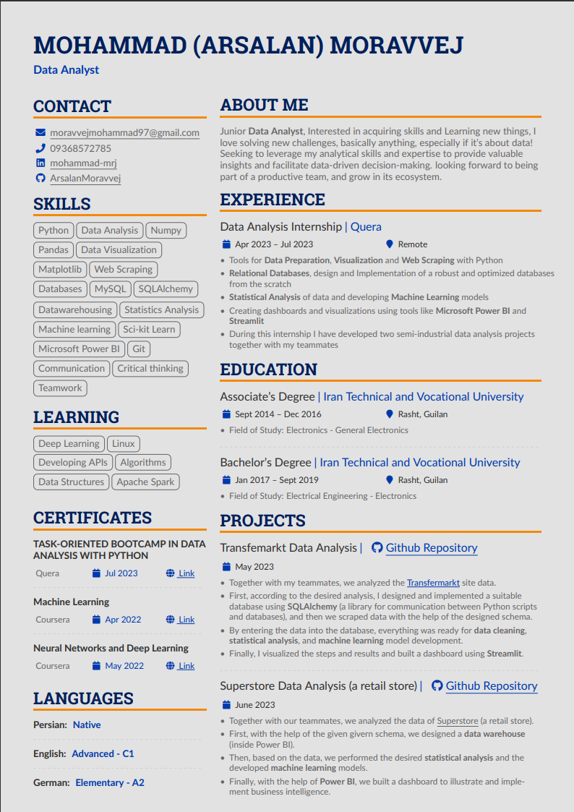

# My Résumé / CV

This is a repository for sharing my Résumé. I built it using Latex with the help of [Overleaf](https://www.overleaf.com/) online Tex editor and by customizing one of its templates (you can find it in `/tempaltes` folder).

(Files `altacv.cls` and `main.tex`)

In order to build your own Résumé you can either simply clone tis repository and start modifying it (Online editors like Overleaf itself are recommended) or go to [Overleaf (Templates — Résumé / CV
)](https://www.overleaf.com/latex/templates/tagged/cv) and choose a Template online.

