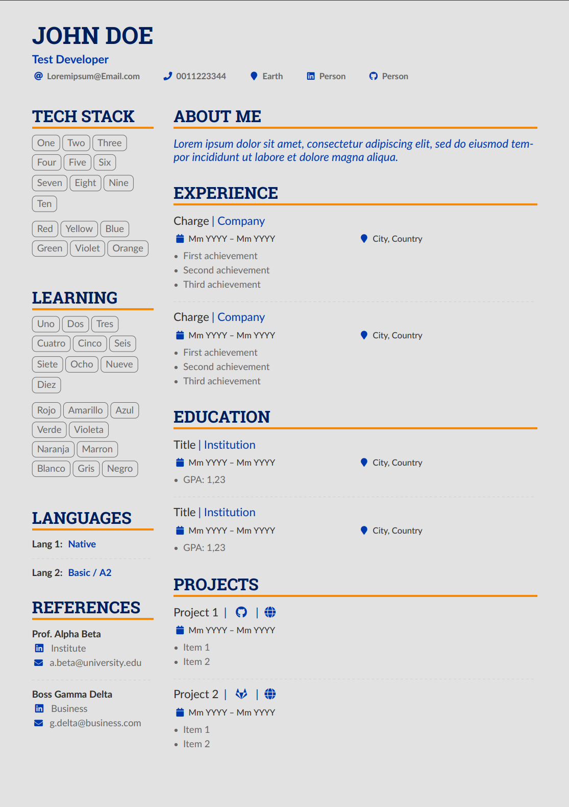
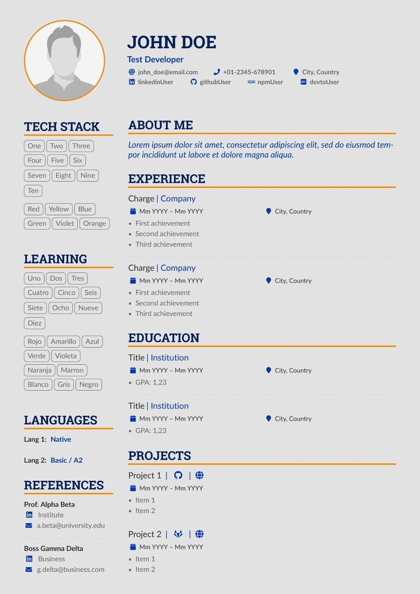

# Template

This is an empty template for the resume.

[Original link](https://www.overleaf.com/latex/templates/altacv-a-nicolasomar-fork/htfpmrwhbwpw)

You can simply clone the repository and start modifying it.

  
  

